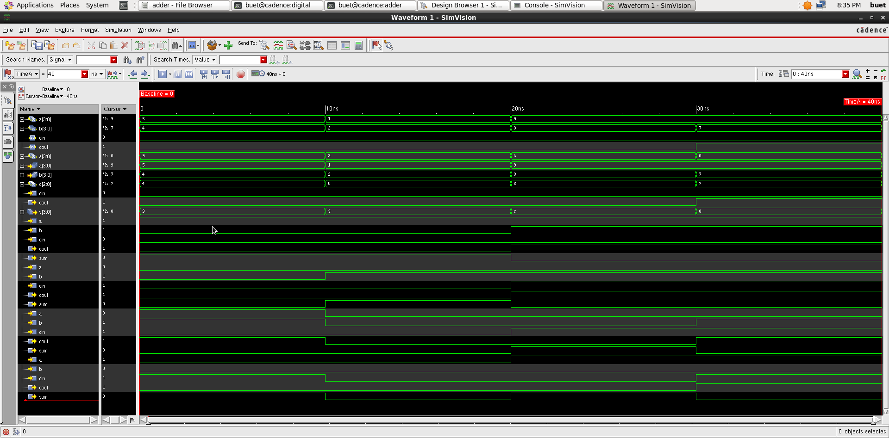

# 4-bit Parallel Adder: RTL Design and Simulation (Verilog)

A 4-bit parallel (ripple-carry) adder built from four 1-bit full adders, written in Verilog and simulated with Cadence NC-Verilog. Waveforms were viewed in Cadence SimVision.

## Design
- `fa`: 1-bit full adder (`sum = a ^ b ^ cin`, `cout = ab + bc + ca`)
- `pa`: 4-bit adder made by chaining four `fa` instances, with the carry rippling from bit 0 to bit 3

## Testbench
`patest` applies four directed input pairs (carry-in held at 0) at 10 ns intervals:

| a | b | cin | Expected sum | Expected cout |
|---|---|-----|--------------|---------------|
| 5 | 4 | 0   | 9            | 0             |
| 1 | 2 | 0   | 3            | 0             |
| 9 | 3 | 0   | C (12)       | 0             |
| 9 | 7 | 0   | 0 (16 wraps) | 1             |

## Result
The SimVision waveform shows the sum and carry-out matching the expected values for all four cases, including the carry-out case (9 + 7).

## Files
- `rtl/adder_4bit.v`: design (`fa`, `pa`)
- `tb/adder_4bit_tb.v`: testbench (`patest`)
- `waveform_simvision.png`: SimVision waveform

## Tools
Verilog, Cadence NC-Verilog, Cadence SimVision

## Limitations and next steps
- Stimulus is directed and carry-in is only tested at 0; carry-in = 1 is not yet covered.
- Checking is done by inspecting waveforms. A self-checking testbench with expected-value comparison is the next improvement.
